</img>

  

## Conheça meus projetos 🤍

<b>Meu Portfólio</b> 
<a href="https://sibellyvih.github.io/Projetos_Sibelly/">
 Clique aqui para conhecer meus projetos, premiações, eventos, artigos científicos e entre outros.
</a>

---

- 🌏 Projetos que fiz sobre o meu intercâmbio 🇳🇿  

  
    <a href="https://sibellyvih.github.io/dicas_de_intercambio/">Dicas de Intercâmbio</a> 
    <a href="https://sibellyvih.github.io/diario_de_intercambio/">Diário de Intercâmbio</a>
   
  

    
  

 

- 🏆 Projeto que foi premiado na XIII Feira de Inovação das Ciências e Engenharias - FIciencias  
  
    <a href="https://sibellyvih.github.io/ECO-BOARD-GAME/index.html">ECO BOARD GAME</a>
  

    
  

---------

  <h3>Contact Me</h3>
  
   

<picture align="center">
  <source media="(prefers-color-scheme: dark)" srcset="https://raw.githubusercontent.com/sibellyvih/sibellyvih/output/github-contribution-grid-snake-dark.svg">
  <source media="(prefers-color-scheme: light)" srcset="https://raw.githubusercontent.com/sibellyvih/sibellyvih/output/github-contribution-grid-snake.svg">
  
</picture>
